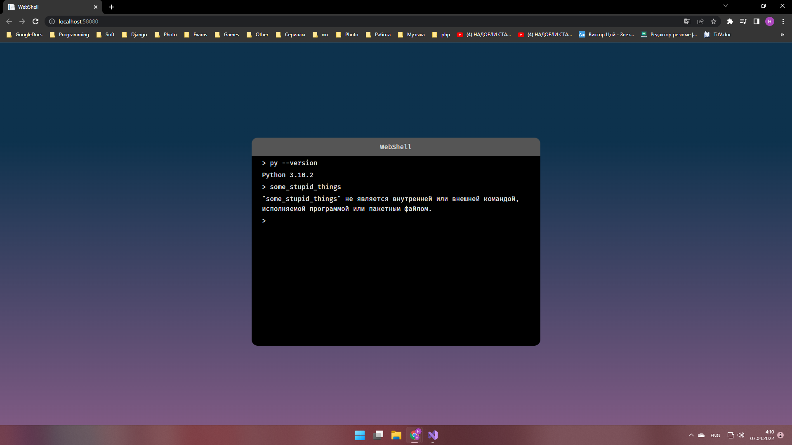

# WebShell

Тестовое задание для *DNS Технологии*.

## ТЗ
Необходимо реализовать веб приложение с функционалом:
1. Ввод консольной команды в текстовое поле на веб странице и отправка её на сервер для выполнения. Команда должна выполняться в любом шелле, который есть в системе;
2. Получение вывода этой команды на сервере (стандартный вывод или вывод ошибки) и отображение на веб странице;
3. Сохранение истории введенных команд в базе данных на сервере, восстанавление истории введенных комманд при входе на страницу, пролистывание истории клавишами "вверх" и "вниз".

Требования к реализации:
1. Используемый фреймворк для разработки бэкенда .NET Сore, язык программирования C#, база данных MSSQL;
2. Обязательно использование асинхронных запросов к серверу;

## Ошибки и недочёты
* "Readme.md" не полон: -- **fixed**
  * Не содержит описание того, что нужно поднимать БД; -- **fixed**
  * Невозможно запустить приложение из-за пункта выше; -- **fixed**
* Невозможно запустить через Kestrel. Порт жестко прописан в js. Смена порта ведет к тому, что приложение обращается не по тому адресу -- **fixed** (теперь используются относительне адреса);
* Стилистика именования. -- **fixed** (разные источники говорят о разном именовании моделей, VS 2022 добавляет "Model" после названия самой модели)

## Вопросы
* Что будет, если запустить через Kestrel? Почему не использовался файл настроек?
*  Что будет, если отправить команду ping -t google.com? Как поправить? (вводим команду, enter, пробел enter, удаляем пробел enter и так можно бесконечно) -- **fixed** (добавлена переменная в js, которая запрещает ввод команды до завершения предыдущей, добавлено ограничение по времени в 5 секунд)
*  Почему нет обработки исключений? Что произойдет, если возникнет исключение? Как можно улучшить?
* Что произойдет на сервере, если 1000 пользователей одновременно будут работать с приложением? Как можно улучшить?

## Реализация
ASP.NET Core 6 MVC

Models:
* Command

Controllers:
* HomeController
* ApiController

API:
* API/GetCommands (GET) -- возвращает историю запросов
* API/ExecuteCommand (POST) -- выполняет запрос и возвращает результат

## Запуск проекта
Package Manager Console -- PM

Command Line Interface -- CLI

Перед запуском необходимо выполнить следующую команду:

`PM> add-migration MyFirstMigration`

или 

`CLI> dotnet ef migrations add MyFirstMigration`

Далее выполнить команду:

`PM> Update-Database`

или 

`CLI> dotnet ef database update`

## Материалы
* [CodeStyle и правила именования](https://docs.microsoft.com/en-us/dotnet/csharp/fundamentals/coding-style/coding-conventions)
* [Руководство по ASP.NET Core 6](https://metanit.com/sharp/aspnet6/)
